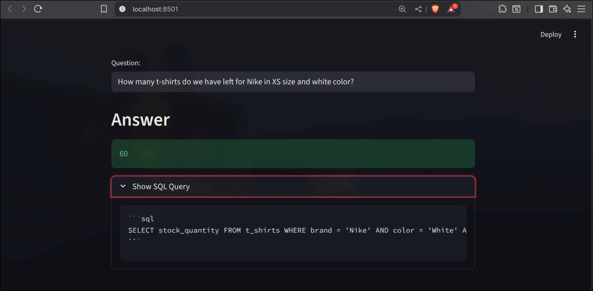

# 👕 AI-Powered T-Shirt Store Assistant (Ollama Edition)

A local GenAI application that helps users query a T-shirt store database using natural language. It runs entirely offline using **Ollama** and **LangChain**, ensuring data privacy and zero API costs.



## 🚀 Features
- **Local LLM Power:** Uses `Llama 3` (or `Mistral`) via Ollama for reasoning.
- **Text-to-SQL:** Converts natural English questions ("How many white Nike shirts do we have?") into SQL queries.
- **Privacy First:** No data leaves your local machine.
- **Few-Shot Learning:** Uses `few_shots.py` to train the model on domain-specific SQL examples.

## 🛠️ Tech Stack
- **Python 3.10+**
- **Ollama** (Local LLM Runner)
- **LangChain** (Orchestration)
- **Streamlit** (Frontend)
- **ChromaDB** (Vector Store for example selection)

## 🔧 Installation & Setup

### 1. Install Ollama
Download and install Ollama from [ollama.com](https://ollama.com).

### 2. Pull the Model
Open your terminal and pull the model you want to use (e.g., Llama 3):
```bash
ollama pull llama3

